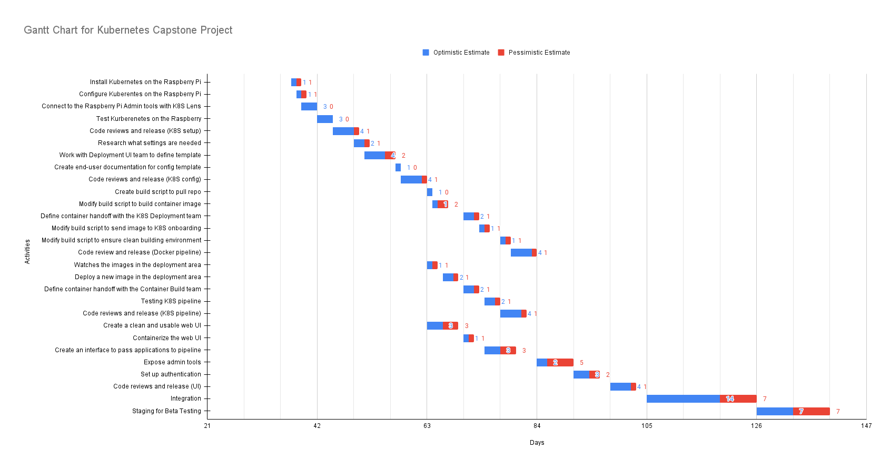

# Iteration Plan & Estimate

\begin{minipage}{\linewidth}
  \color{Bittersweet}
  Changes from Winter Term 2022: No changes have been made to this section. \\
  Changes from Spring Term 2022: No changes have been made to this section.
\end{minipage}

## Kubernetes Setup (Sprint 2 - 3)

a. Install Kubernetes on the Raspberry Pi **(1-2 days)**
b. Configure Kubernetes on the Raspberry Pi **(1-2 days)**
c. Connect to the Raspberry Pi Admin tools with K8S Lens **(3 Days)**
d. Test Kubernetes on the Raspberry **(3 days)**
e. Code Reviews and release **(4-5 Days)**

## Kubernetes CI/CD Config File Integration (Sprint 3)

a. Research what settings is needed **(2-3 days)**
b. Work with Deployment UI Website team to define template format **(4-6 days)**
c. Create end-user documentation for config template **(1 days)**
d. Code Reviews and release **(4-5 Days)**

## Github Container Build Pipeline (Sprint 4-5)

a. Create build script to pull repo from user-provided github **(1 day)**
b. Modify build script to build container image **(1-3 days)**
c. Coordinate with K8S Deployment team to define container handoff API **(2-3 days)**
d. Modify build script to send built image to K8S onboarding **(1-2 days)**
e. Modify script to ensure clean building environment **(1-2 days)**
f. Modify script to use user-selected generic Dockerfile if none provided **(3-4 days) \[stretch\]**
g. Integrate build pipeline with Github Actions **(5-7 days) \[stretch\]**
h. Code Reviews and release **(4-5 Days)**

## K8S Deployment (Sprint 4 - 5)

a. Watch the images in the deployment area **(1-2 days)**
b. Deploy a new image in the deployment area **(2-3 days)**
c. Coordinate with Github Container Build team to define container handoff API **(2-3 days)**
d. Testing **(2-3 Days)**
e. Code Reviews and release **(4-5 Days)**

## Deployment UI Website (User Facing) (Sprint 4-5)

a. Create a clean and usable web UI **(3-6 days)**
b. Containerize the web UI and self-host on the cluster **(1 day)**
c. Create an interface to pass applications as well as necessary configuration settings to the pipeline for deployment
   **(3-6 days)**
d. Set up an automated system for containerizing an application to be passed to the pipeline that is not yet
   containerized **(2-4 days) \[stretch\]**
e. Expose admin tools, such as Lens IDE **(2-7 days)**
f. Set up authentication **(3-5 days)**
g. Code reviews and release **(4-5 days)**

## Integration (Sprint 6)

a. Integrate the backend service **(7 days)**
  i.  Work with the Kubernetes CI/CD Config File Integration, Github Container, and K8S Deployment team to integrate the
      backend service.
  ii. Internally test (Alpha Testing) the full pipeline, so a developer should be able to deploy a web application with
      internal tools **(7-10 Days).**

b. Integrate the connection with the backend with the Deployment UI Website **(7-14 days)**
  i.  Work with Kubernetes CI/CD Config File Integration team to define template format **(4-6 days)**
  ii. Internally test (Alpha Testing) the full pipeline, so a developer should be able to deploy a web application with
      the Deployment UI portal **(7-10 Days).**

c. Code Review and Release **(7 days)**

## Beta Testing (Sprint 7)

a. Utilize multiple test web application for beta testing **(7-14 days)**
  i.  Provide an user with a Github link that contains a web application project, instruct the new users to onboard the
      web application project to our service.

\pagebreak
