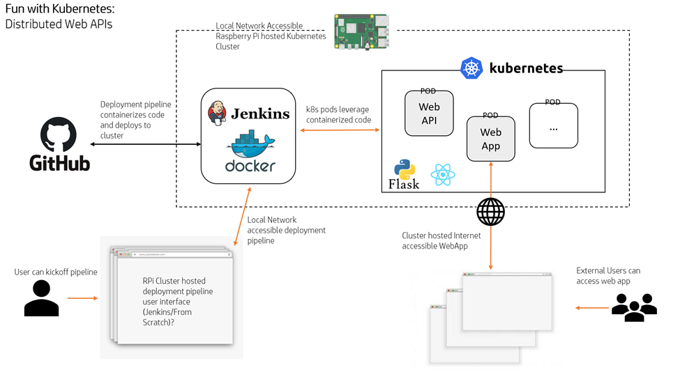
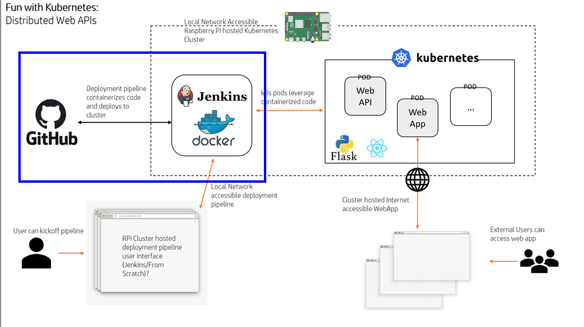
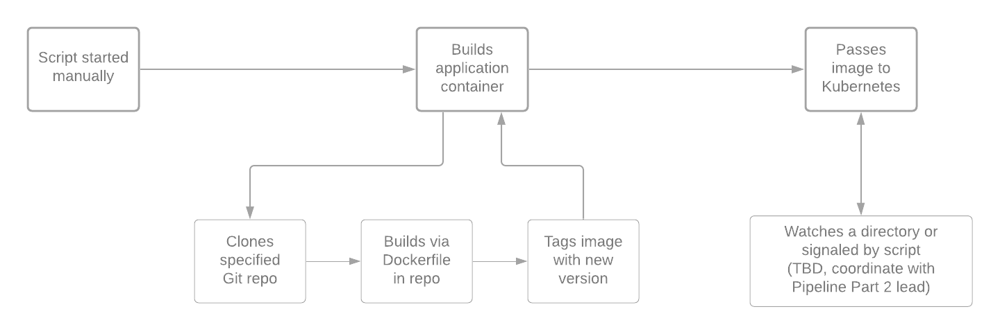

# WIC: Individual Contribution

## Robert Detjens

---

### Process Flows

\pagebreak

### User Stories

>= 5

When writing these user stories, also consider all the potential stakeholders in the project and your individual contribution to the overall project. The list of stakeholders should include, at a minimum, the groups of end users of the final product, the sponsor of the project (the client or project partner) and the development team(s) of the project. We encourage you to write at least one user story for each of the stakeholders

### Personal Iteration Plan

provide an estimation of when you think this work might occur, as well as any notes on what your work depends on

### Solution Architecture

Provide an explanation of the design choices that were made, as well as any reference or extra details about the context diagram or other figures you used to show your part of the project.
